<div align="center">

# 🎥 DiDi_OK × Seedance 2.5 Cinematic Prompt Skill

**Turn a story or reference asset into a cinematic video prompt with coherent space, motivated camera movement, believable action, and production-ready live sound.**

[简体中文](README.md) · [English](README_EN.md)

[](https://agentskills.io/)
[](https://seed.bytedance.com/en/seedance2_5)
[](https://github.com/openai/codex)
[](https://docs.anthropic.com/en/docs/claude-code)
[](https://qwenlm.github.io/qwen-code-docs/zh/users/features/skills/)
[](CONTRIBUTING.md)

[Quick start](#quick-start) · [Work stills](#didi_ok-work-stills) · [Six source cases](#six-didi_ok-cases) · [Test prompts](prompt-library/test-cases-v1.md) · [Method library](#method-library) · [Contributing](CONTRIBUTING.md)

</div>

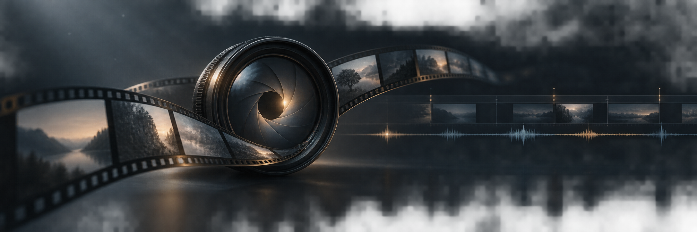

---

This is not a cinematic-keyword generator. Its primary rule source is a set of six DiDi_OK analyses of *Candy*. The skill builds a visual contract and spatial topology first, then designs camera movement, physical causality, focus behavior, micro-performance, dialogue, live sound, and shot-specific failure prevention.

Every production prompt must state: **No BGM. No musical score.**

## Why it exists

| Common failure | What this skill does |
| --- | --- |
| “Cinematic, realistic, 8K” still produces an empty image | Locks aspect ratio, photographic medium, realism, palette, and dramatic tone first |
| Blocking, eyelines, and occlusion drift | Defines foreground, midground, background, left/right, inside/outside, and camera position |
| Camera terms are listed without an executable path | Specifies direction, speed, framing change, motivation, and operator response |
| Objects float or actions skip their physical middle state | Writes trigger, contact, force, resistance, inertia, reaction, and visible result |
| Everyone reacts at the same moment | Staggers breath, gaze, pauses, subtext, and response timing |
| Dialogue is disconnected from the shot | Synchronizes exact dialogue with delivery, body action, focus, and listener response |
| The model invents emotional music | Explicitly requires live sound only and rejects BGM in every final prompt |
| The scene is overcrowded or an arbitrary duration appears | Keeps unsolicited seconds out of the prompt body, then recommends duration separately |

## Quick start

```text
Use $ddok-video-prompt to turn “On a rainy night, a delivery rider hears a familiar melody outside a record shop that is about to close” into a realistic cinematic Seedance 2.5 prompt.
```

## Workflow

1. Preserve the user's story, characters, dialogue, framing, restrictions, and reference responsibilities.
2. Establish spatial topology among subjects, camera, layers, eyelines, and occlusion.
3. Organize the event as initial state, trigger, intermediate state, reaction, and visible result.
4. Select motivated framing, focus behavior, camera path, and shot form.
5. Add physical feedback, micro-performance, exact dialogue, and spatially layered live sound.
6. Add shot-specific failure prevention and explicitly reject BGM and musical score.
7. Apply the 100-point rubric; rewrite before delivery if the score is below 90 or a hard gate fails.
8. After the prompt body, recommend a generation duration based on content capacity.

## DiDi_OK work stills

The following user-provided stills form a cross-project DiDi_OK gallery. They demonstrate visual outcomes across subjects, but they are not presented as the six *Candy* rule cases or as results from the five pending Seedance 2.5 validation prompts.

<table>
  <tr>
    <td width="50%">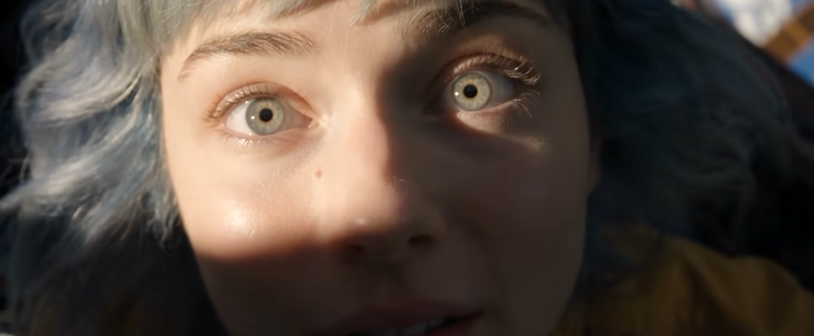<br><sub>Extreme close-up: partial light, proximity, and visual attention</sub></td>
    <td width="50%">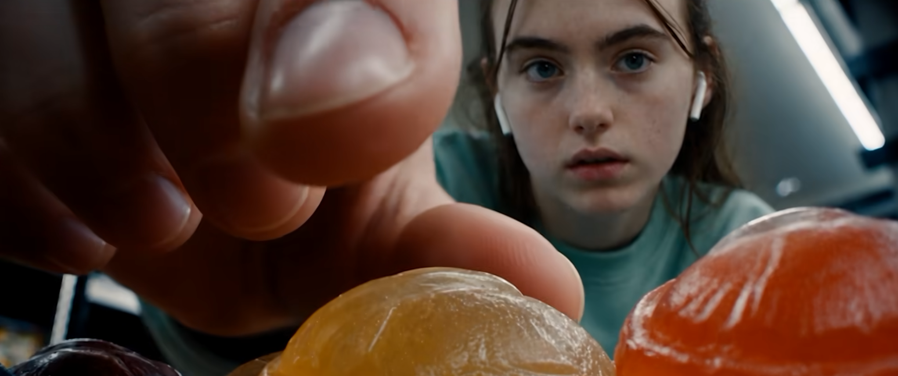<br><sub>Foreground pickup: ground-level camera, scale, and finger interaction</sub></td>
  </tr>
  <tr>
    <td width="50%">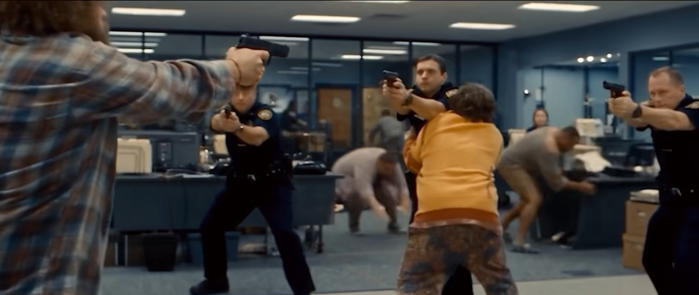<br><sub>Office standoff: blocking, eyeline conflict, and spatial pressure</sub></td>
    <td width="50%">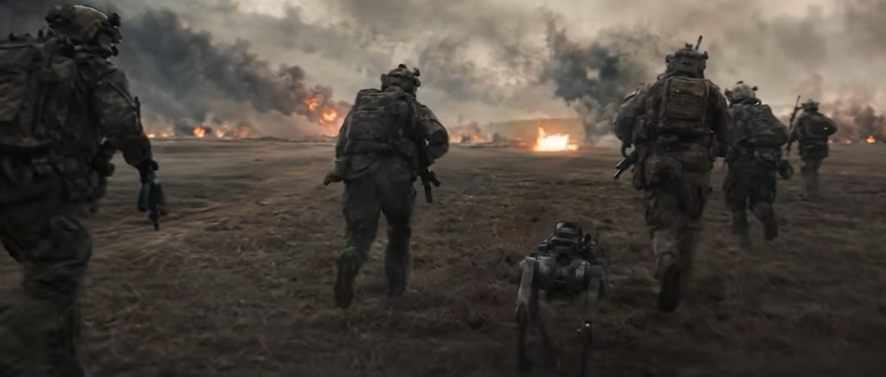<br><sub>Battlefield follow: rear tracking perspective, smoke layers, and group advance</sub></td>
  </tr>
  <tr>
    <td width="50%">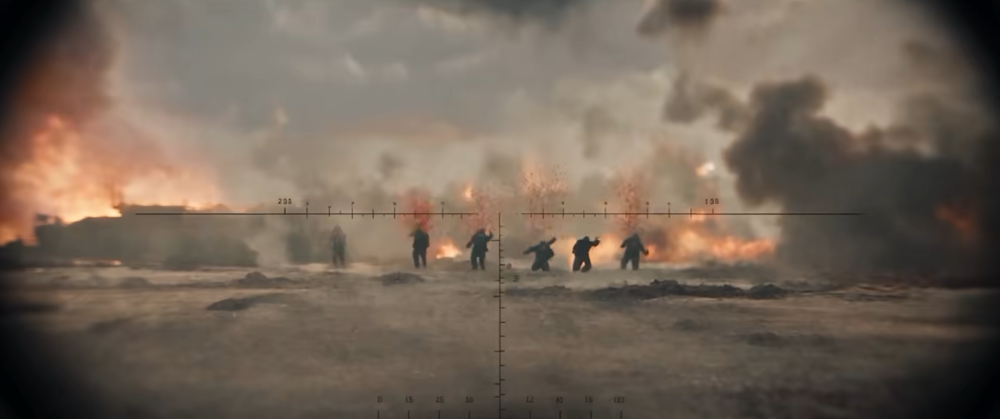<br><sub>Scope view: distant evidence, subjective field of view, and target compression</sub></td>
    <td width="50%">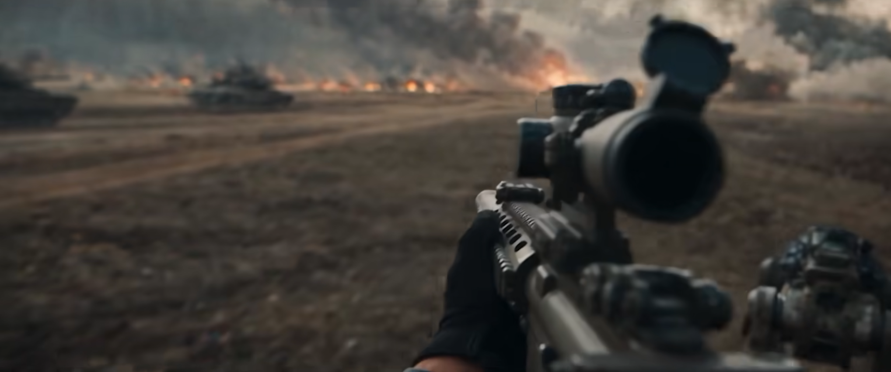<br><sub>First-person battlefield: weapon foreground, squad depth, and movement direction</sub></td>
  </tr>
  <tr>
    <td width="50%">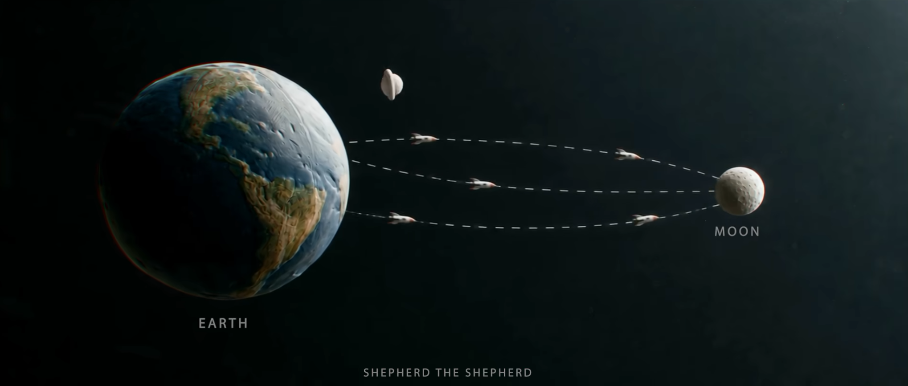<br><sub>SHEPHARD THE SHEPHERD: graphic spatial relations and story information</sub></td>
    <td width="50%">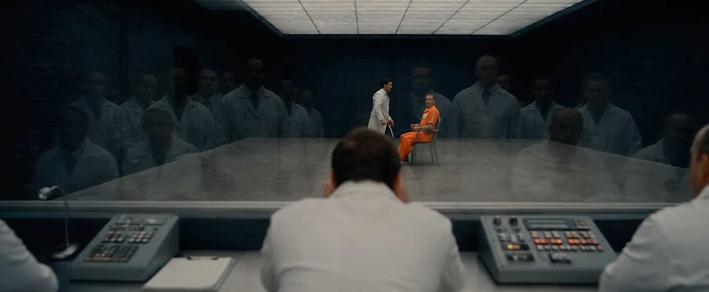<br><sub>Laboratory observation: glass separation, spectatorship, and institutional pressure</sub></td>
  </tr>
  <tr>
    <td width="50%">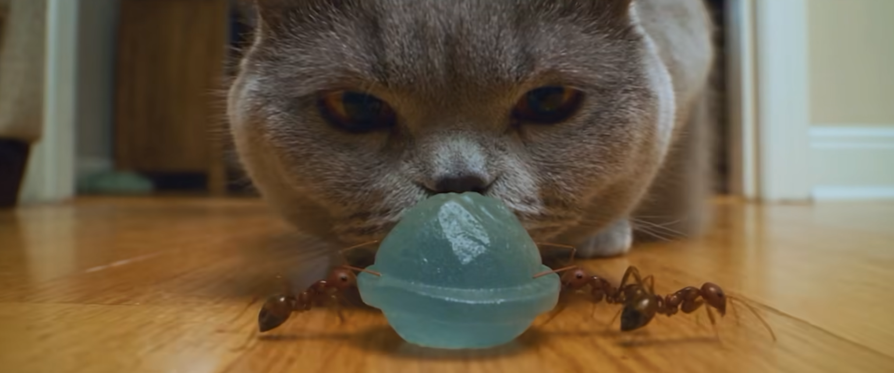<br><sub>Cat, ants, and candy: macro scale conflict, material, and depth</sub></td>
    <td width="50%">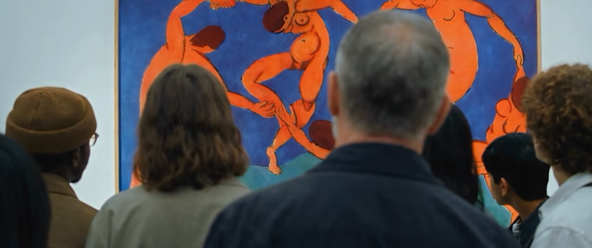<br><sub>Museum ensemble: layered backs, shared object, and focus relay</sub></td>
  </tr>
</table>

## Six DiDi_OK cases

The repository keeps the source material as six distinct cases: macro ants moving candy, a laboratory ensemble and candy rupture, a female spokesperson, a move-behind-subject occlusion transition, foreground candy pickup, and museum ensemble dialogue.

[Read the six source cases](references/cases.md) · [Read the frequency analysis](references/case-pattern-analysis.md)

## Test prompts

Five prompts are ready for real Seedance 2.5 generation and post-generation review: a watch repairer, a restaurant ensemble, a mechanical watch product shot, a concrete library, and a hand-drawn seaside-train scene.

[Open all five production prompts](prompt-library/test-cases-v1.md)

## Installation

```bash
npx skills add wusuyee-beep/seedance-2.5-cinematic-prompt-skill -g
```

Or clone the full repository and place it in the target agent's Skills directory:

```bash
git clone https://github.com/wusuyee-beep/seedance-2.5-cinematic-prompt-skill.git ddok-video-prompt
```

Do not copy only `SKILL.md`; the cases, rubric, duration rules, and Seedance capability boundaries live in `references/`.

## Method library

| File | Purpose |
| --- | --- |
| [`cases.md`](references/cases.md) | Six independent DiDi_OK source cases |
| [`case-pattern-analysis.md`](references/case-pattern-analysis.md) | Shared, frequent, and shot-specific patterns with occurrence rates |
| [`method.md`](references/method.md) | Method for turning a rough idea into an executable video prompt |
| [`templates.md`](references/templates.md) | Continuous-shot, reference-input, dialogue, and delivery templates |
| [`seedance-2.5.md`](references/seedance-2.5.md) | Official capability boundaries and model adaptation |
| [`duration-recommendation.md`](references/duration-recommendation.md) | Duration recommendation after the prompt body |
| [`review-rubric.md`](references/review-rubric.md) | 100-point pre-delivery audit and hard gates |

## Sources

- [Official Seedance 2.5 page](https://seed.bytedance.com/en/seedance2_5)
- [Official Seedance 2.5 introduction](https://seed.bytedance.com/en/blog/one-take-creation-flexible-referencing-introducing-seedance-2-5)
- [DiDi_OK analysis of *Candy*](https://bytedance.larkoffice.com/wiki/L6Pywea3KiBEqAkg3N9cunZdnFg)

## Related project

- [Cinematic Image Prompt Skill](https://github.com/wusuyee-beep/cinematic-image-prompt-skill) handles single-frame image prompts without time, camera motion, or sound rules.

## License

[MIT](LICENSE)
