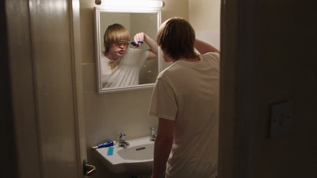
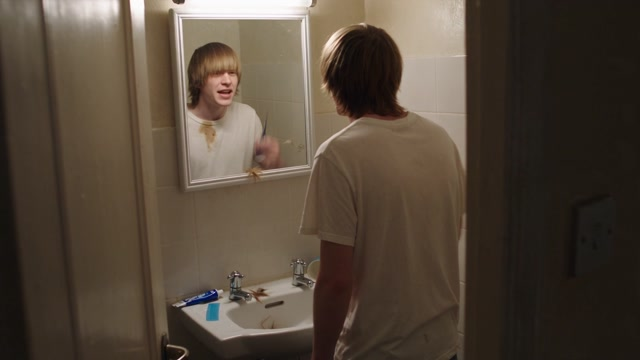
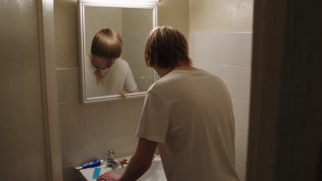
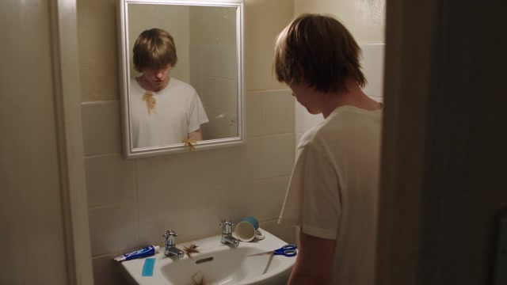
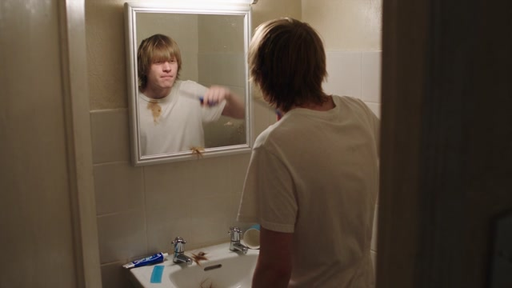

# 单人物实测：浴室剪坏刘海

这是单人物真人写实测试 Case。提示词通过六句完整独白、两次剪发与逐步恶化的可见后果，验证一镜到底、镜面表演、手持靠近、现场同期声和英式克制喜剧节奏。

## 实测信息

| 项目 | 内容 |
| --- | --- |
| 模式 | 文生视频 |
| 画幅 | 16:9 |
| 成片 | 1280×720，24 fps，H.264 + AAC |
| 实际时长 | 30.08 秒 |
| 镜头 | 单镜头手持观察 |
| 声音 | 英式英语独白、浴室同期声、无 BGM、无配乐 |

[播放原始成片](bathroom-haircut-result.mp4) · [查看完整生成提示词](../../prompt-library/test-cases-v2.md#case-2单人物写实表演浴室剪坏刘海)

## 静帧

| 起始自信 | 第一次失手 | 再次补救 |
| --- | --- | --- |
|  |  |  |

| 逐渐认清后果 | 最终认命 |
| --- | --- |
|  |  |

## 这个 Case 验证什么

- 摄影机身份明确：像站在浴室门外观察的室友，而不是广告机位。
- 每句台词都有动作、表情或可见后果承接，不让对白悬空。
- 镜面倒影、人物后脑和摄影机靠近保持同一空间关系。
- 两次“嚓”、金属碰瓷器、碎发落池和关灯声为动作提供同步证据。
- 结尾用停止第三次剪发与“I'm buying a hat.”完成认知转折。
- 全程明确“无 BGM，无配乐！”，音乐不参与情绪操控。

## 审核结论

提示词内部审核为 96/100；原始成片已回填。成片是否完全复现六句台词、所有动作和全部同期声，应继续按真实输出逐项记录，不用“已生成”代替结果分析。
