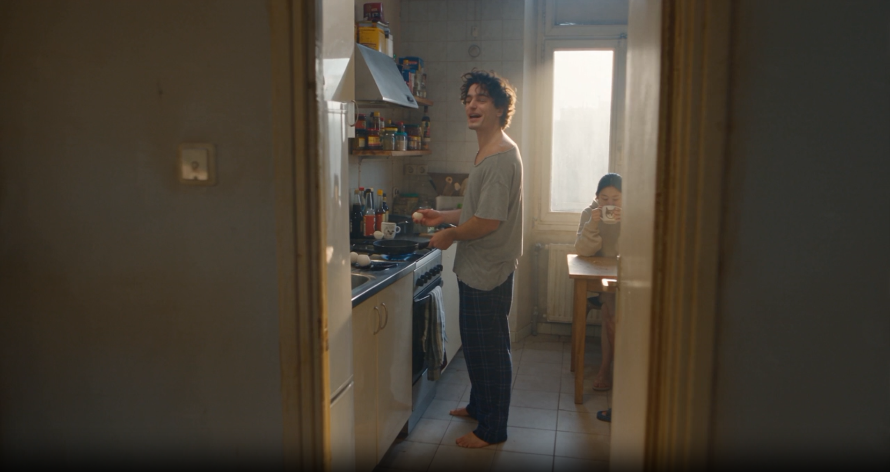
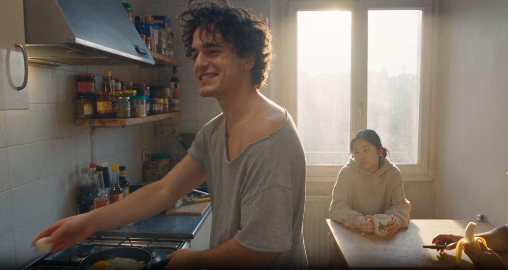
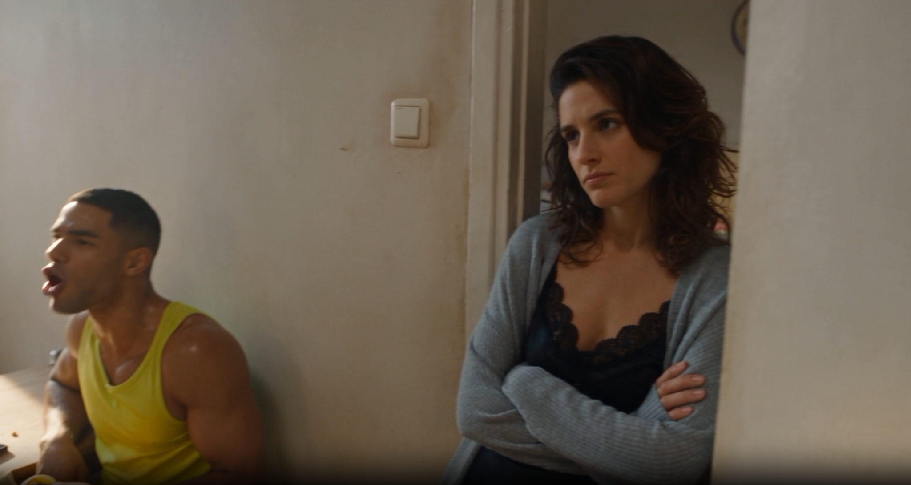
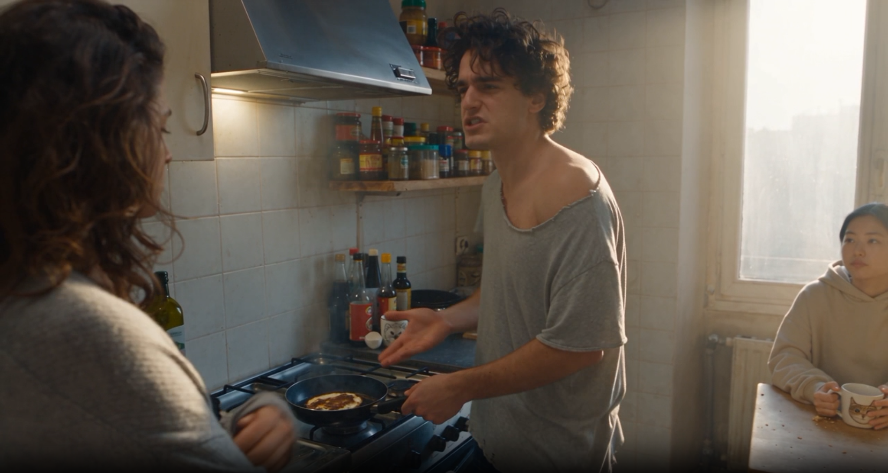
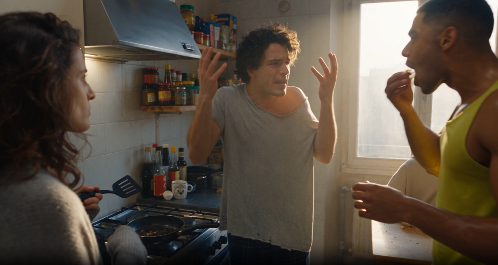

# 实测 Case：合租厨房里的焦边煎蛋

这是本仓库第一条正式完成“完整 Prompt → Seedance 成片 → 静帧核对”的群像测试 Case。原 Prompt 由用户提供并确认合格，作为测试集的文字密度与执行精度基准。

## 成片信息

| 项目 | 实测值 |
| --- | --- |
| 类型 | 真人写实群像、一镜到底、手持纪录片跟拍 |
| 画幅 | 16:9 |
| 分辨率 | 1280 × 720 |
| 帧率 | 24fps |
| 实际时长 | 30.08 秒 |
| 视频编码 | H.264 |
| 音频 | AAC，32kHz，双声道 |
| 原片状态 | 未经剪辑，保留原始音轨 |

[查看或下载未经剪辑的成片](shared-kitchen-result.mp4)

[查看完整生成 Prompt](../../prompt-library/test-cases-v2.md#case-1质量标杆合租厨房里的焦边煎蛋)

## 代表静帧

<table>
  <tr>
    <td width="50%"> 门框起始机位：Marco 在灶台前，Yuki 位于窗边折叠桌</td>
    <td width="50%"> 灶台、窗户与折叠桌的连续关系，Lucas 从右侧进入画面</td>
  </tr>
  <tr>
    <td width="50%"> Lucas 与 Chloé 的差异化反应及门框位置</td>
    <td width="50%"> Chloé 介入灶台，Marco 继续争辩，Yuki 保持背景观察</td>
  </tr>
  <tr>
    <td colspan="2"> 群像收束：Marco 的夸张手势、Lucas 品尝煎蛋、Chloé 持锅铲，人物反应并不同步</td>
  </tr>
</table>

## 初步核对

从用户提供的五张静帧可确认：

- 门框起始、灶台、右侧窗户与折叠桌形成了可辨认的连续空间。
- Marco 的灰色宽松 T 恤、格纹睡裤、赤脚和卷发；Yuki 的米色连帽卫衣与猫脸马克杯；Lucas 的黄色背心；Chloé 的灰色开衫与黑色内搭均获得清楚区分。
- 暖色窗光、厨房油烟、米白瓷砖、杂乱调料与使用痕迹共同维持真人实拍质感，没有变成干净广告棚拍。
- 灶台动作、锅铲、香蕉、马克杯和人物夸张但错开的反应能够在关键帧中被识别。

对白是否逐句完整、人物远近音量、画内手机桑巴声与“无后期 BGM”约束，需要结合原始音轨逐句复核；在完成音频转写前不提前声称全部通过。

## 与后续测试的关系

本 Case 负责验证多人物站位、完整对白、反应时差、连续手持运镜和复杂同期声。仓库的另一条测试只保留“单人物”方向，不再按产品、建筑、动漫等题材继续分类。
